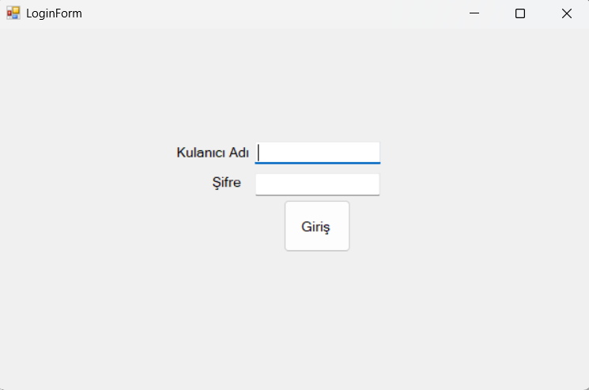
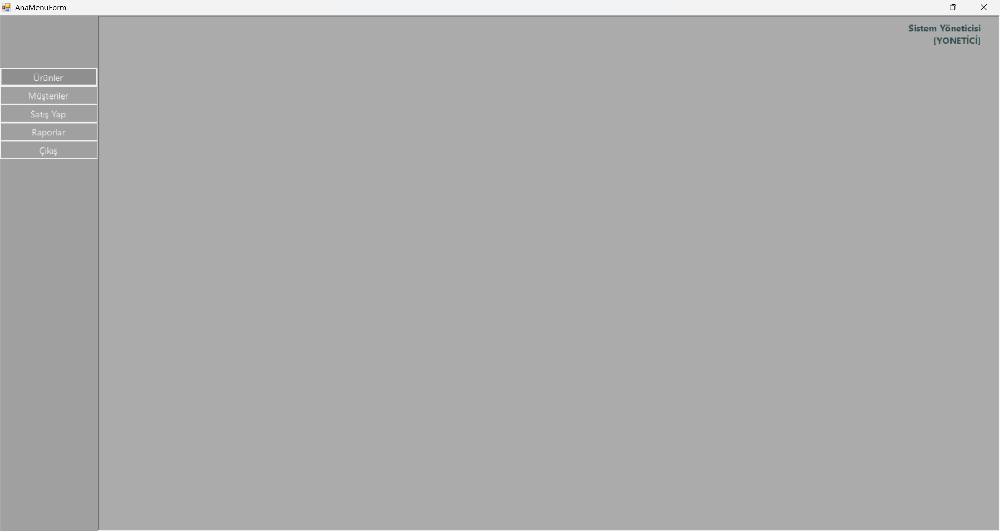
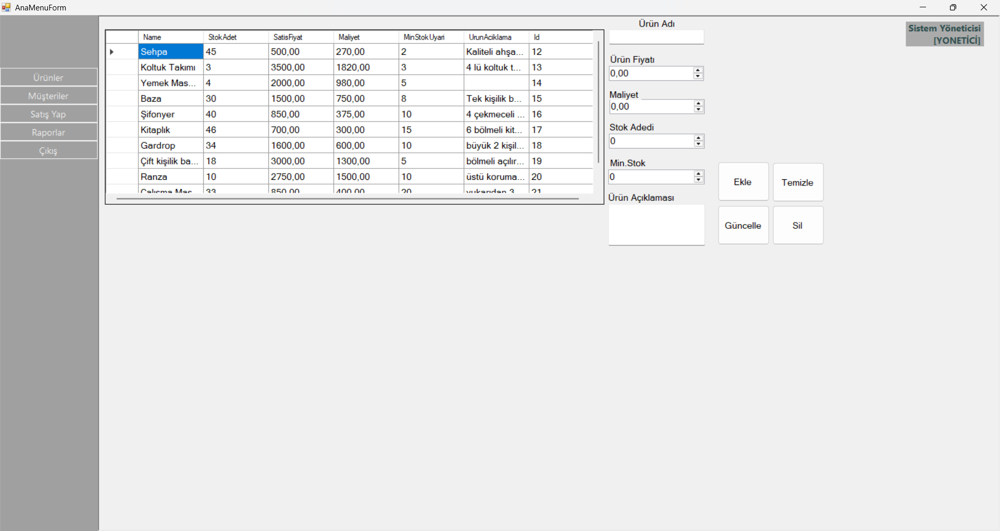
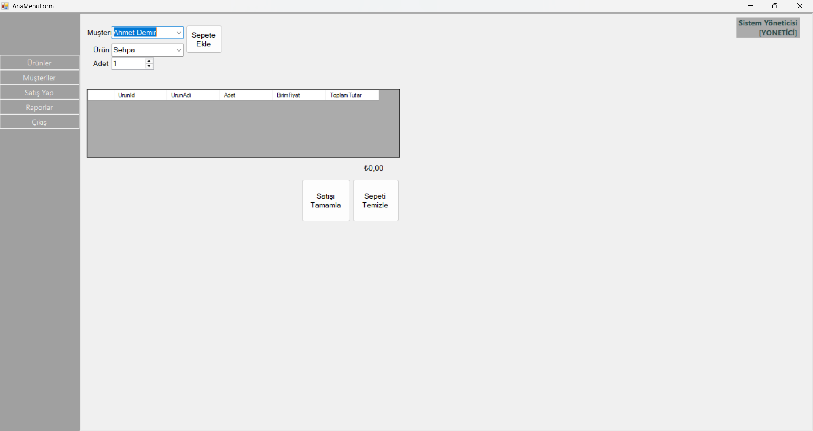
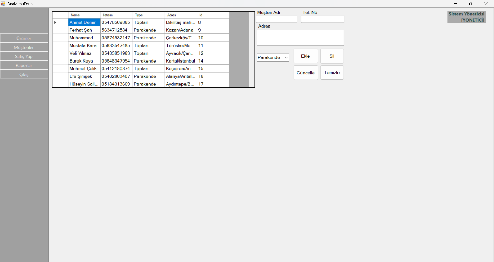
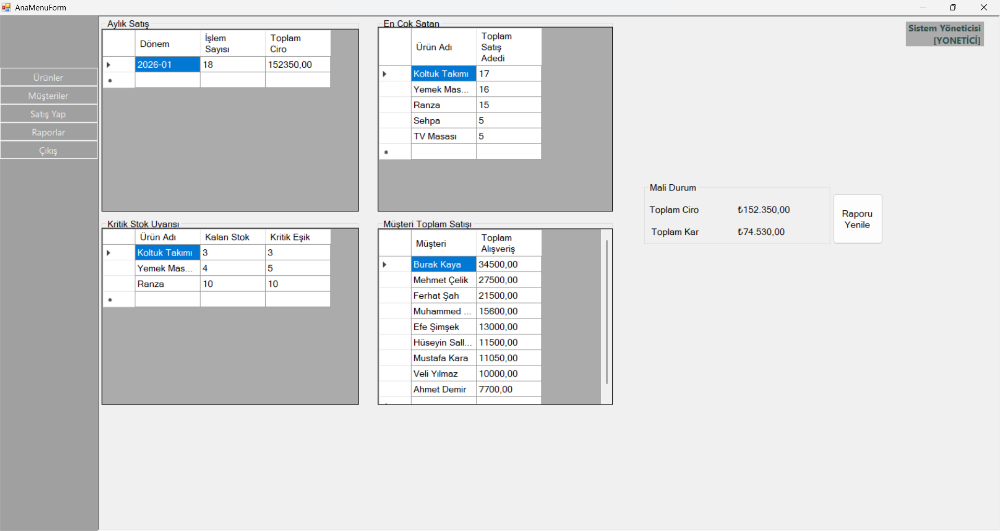

# Stok Takip Otomasyonu

İşletmelerin ürün stoklarını, müşteri ilişkilerini ve satış süreçlerini dijital ortamda takip etmelerini sağlayan kapsamlı bir masaüstü uygulamasıdır. Bu proje, stok giriş-çıkışlarını kontrol altına almak, satışları hızlandırmak ve detaylı finansal raporlar sunmak amacıyla geliştirilmiştir.

## 📌 Proje Özellikleri

- **Kullanıcı Girişi**: Güvenli kullanıcı doğrulama sistemi.
- **Ürün Yönetimi**: Ürün ekleme, güncelleme, silme ve stok takibi. Kritik stok seviyesindeki ürünler için uyarı sistemi.
- **Müşteri Yönetimi**: Perakende ve toptan müşteri ayrımı ile müşteri veritabanı yönetimi.
- **Satış İşlemleri**: Sepet mantığı ile ürün satışı gerçekleştirme ve stoktan otomatik düşüş.
- **Detaylı Raporlama**: 
  - Günlük/Aylık Ciro ve Kar hesaplamaları.
  - En çok satan ürünlerin analizi.
  - Müşteri bazlı ciro raporları.
  - Kritik stok raporu.
- **Katmanlı Mimari**: Sürdürülebilir ve geliştirilebilir kod yapısı (Entity, DAL, BLL, UI).

---

## 📂 Kullanılan Teknolojiler

- **C#** (.NET Framework)
- **Windows Forms** (Masaüstü uygulama tasarımı)
- **MySQL** (Veritabanı)
- **N-Tier Architecture**: Katmanlı mimari (DAL, BLL, Entities, UI)
- **Object Oriented Programming (OOP)** prensipleri.

---

## 📸 Ekran Görüntüleri

### Giriş Ekranı

Kullanıcı adı ve şifre ile sisteme güvenli giriş yapılmasını sağlayan arayüz.

### Ana Menü

Tüm modüllere (Ürün, Müşteri, Satış, Raporlar) tek bir noktadan erişim sağlayan dashboard.

### Ürün Yönetimi

Stoktaki ürünlerin listelendiği, yeni ürün girişinin yapıldığı ve fiyat/stok güncellemelerinin yönetildiği ekran.

### Satış İşlemleri

Müşteri ve ürün seçimi yapılarak sepet oluşturulan ve satışın tamamlandığı ekran. Satış sonrası stoklar otomatik güncellenir.

### Müşteri Yönetimi

Müşteri iletişim bilgileri ve müşteri türünün (Toptan/Perakende) yönetildiği ekran.

### Finansal Raporlar

İşletmenin kar/zarar durumunu, cirosunu ve kritik stoktaki ürünleri grafiksel ve listeler halinde sunan analiz ekranı.

---

## 🚀 Kurulum ve Kullanım

1. Projeyi bilgisayarınıza indirin (Clone veya Zip).
2. **MySQL** veritabanınızda gerekli tablo yapısını oluşturun (Veritabanı scripti eklenecektir).
3. `Baglanti.cs` veya `App.config` dosyasındaki veritabanı bağlantı cümleciğini (Connection String) kendi yerel sunucunuza göre düzenleyin.
4. Çözümü **Visual Studio** ile açıp `Start` tuşuna basarak çalıştırın.

---

## 🛠️ Proje Mimarisi

Proje, **Solid Prensipleri** gözetilerek 4 ana katman üzerine inşa edilmiştir:

- **Entities**: Veritabanı tablolarına karşılık gelen nesneler (Urun, Musteri, Satis vb.).
- **DAL (Data Access Layer)**: Veritabanı ile iletişim kuran, CRUD işlemlerini yapan katman.
- **BLL (Business Logic Layer)**: İş kurallarının işlendiği (örn: Stok yeterli mi? Fiyat negatif olamaz vb.) katman.
- **UI (User Interface)**: Kullanıcının etkileşime girdiği Windows Forms arayüzleri.

---

## 📞 İletişim

Proje ile ilgili sorularınız için:

- **Geliştirici**: [Muhammed Mustafa Kara]
- **Bölüm**: Yönetim Bilişim Sistemleri
- **E-posta**: [mu.mustafakara@gmail.com]
