# Stok Takip Otomasyonu

İşletmelerin ürün stoklarını, müşteri ilişkilerini ve satış süreçlerini dijital ortamda takip etmelerini sağlayan kapsamlı bir masaüstü uygulamasıdır. Bu proje, stok giriş-çıkışlarını kontrol altına almak, satışları hızlandırmak ve detaylı finansal raporlar sunmak amacıyla geliştirilmiştir.

## 📌 Proje Özellikleri

- **Kullanıcı Girişi**: Güvenli kullanıcı doğrulama sistemi.
- **Ürün Yönetimi**: Ürün ekleme, güncelleme, silme ve stok takibi. Kritik stok seviyesindeki ürünler için uyarı sistemi.
- **Müşteri Yönetimi**: Perakende ve toptan müşteri ayrımı ile müşteri veritabanı yönetimi.
- **Satış İşlemleri**: Sepet mantığı ile ürün satışı gerçekleştirme ve stoktan otomatik düşüş.
- **Detaylı Raporlama**: 
  - Günlük/Aylık Ciro ve Kar hesaplamaları.
  - En çok satan ürünlerin analizi.
  - Müşteri bazlı ciro raporları.
  - Kritik stok raporu.
- **Katmanlı Mimari**: Sürdürülebilir ve geliştirilebilir kod yapısı (Entity, DAL, BLL, UI).

---

## 📂 Kullanılan Teknolojiler

- **C#** (.NET Framework)
- **Windows Forms** (Masaüstü uygulama tasarımı)
- **MySQL** (Veritabanı)
- **N-Tier Architecture**: Katmanlı mimari (DAL, BLL, Entities, UI)
- **Object Oriented Programming (OOP)** prensipleri.

---

## 📸 Ekran Görüntüleri

### Giriş Ekranı


Kullanıcı adı ve şifre ile sisteme güvenli giriş yapılmasını sağlayan arayüz.

### Ürün Yönetimi


Stoktaki ürünlerin listelendiği, yeni ürün girişinin yapıldığı ve fiyat/stok güncellemelerinin yönetildiği ekran.

### Satış İşlemleri


Müşteri ve ürün seçimi yapılarak sepet oluşturulan ve satışın tamamlandığı ekran. Satış sonrası stoklar otomatik güncellenir.

### Müşteri Yönetimi


Müşteri iletişim bilgileri ve müşteri türünün (Toptan/Perakende) yönetildiği ekran.

### Finansal Raporlar


İşletmenin kar/zarar durumunu, cirosunu ve kritik stoktaki ürünleri grafiksel ve listeler halinde sunan analiz ekranı.

---
### Veritabanı İlişkileri (ER Diyagramı)
```mermaid
erDiagram
    MUSTERI ||--o{ SATIS : "Siparis Verir"
    KULLANICI ||--o{ SATIS : "Islemi Yapar"
    SATIS ||--|{ SATIS_DETAY : "Icerir"
    URUN ||--o{ SATIS_DETAY : "Listelenir"

    MUSTERI {
        int Id PK
        string Name
        string Iletisim
        string Adres
        string Type
    }
    URUN {
        int Id PK
        string Name
        int StokAdet
        decimal SatisFiyat
        decimal Maliyet
        int MinStokUyari
    }
    KULLANICI {
        int Id PK
        string UserName
        string Password
        string Role
    }
    SATIS {
        int Id PK
        int MusteriId FK
        int PersonelId FK
        DateTime SatisTarih
        decimal ToplamTutar
    }
    SATIS_DETAY {
        int SatisId FK
        int UrunId FK
        int Adet
        decimal Fiyat
    }
 ```


### 2. Class (Sınıf) Diyagramı Kodu

Bu kod, Entity katmanındaki sınıflarını ve birbirlerine olan bağlantılarını gösterir.


### Sınıf (Class) Diyagramı
```mermaid
classDiagram
    class Urun {
        +int Id
        +string Name
        +int StokAdet
        +decimal SatisFiyat
        +decimal Maliyet
        +int MinStokUyari
        +string UrunAciklama
    }
    class Musteri {
        +int Id
        +string Name
        +string Iletisim
        +string Adres
        +string Type
    }
    class Satis {
        +int Id
        +int MusteriId
        +int PersonelId
        +DateTime SatisTarih
        +decimal ToplamTutar
    }
    class SatisDetay {
        +int SatisId
        +int UrunId
        +int Adet
        +decimal Fiyat
    }
    class Kullanici {
        +int Id
        +string UserName
        +string Password
        +string Role
    }

    Satis ..> Musteri : Kullanır
    Satis ..> Kullanici : Kullanır
    SatisDetay ..> Satis : Bağlıdır
    SatisDetay ..> Urun : İçerir


```

### 3. Use-Case (Akış) Diyagramı Kodu

### Kullanım Senaryosu (Use-Case)

```mermaid
graph TD
    User((Personel))
    
    subgraph "Stok Takip Sistemi"
        Login(Giriş Yap)
        UrunYonet(Ürün Ekle/Sil/Güncelle)
        MusteriYonet(Müşteri Yönetimi)
        SatisYap(Satış & Sepet İşlemleri)
        RaporAl(Finansal Raporlar)
    end

    User --> Login
    Login --> UrunYonet
    Login --> MusteriYonet
    Login --> SatisYap
    Login --> RaporAl
```

## 🚀 Kurulum ve Kullanım

1. Projeyi bilgisayarınıza indirin (Clone veya Zip).
2. **MySQL** veritabanınızda gerekli tablo yapısını oluşturun (Veritabanı scripti eklenecektir).
3. `Baglanti.cs` veya `App.config` dosyasındaki veritabanı bağlantı cümleciğini (Connection String) kendi yerel sunucunuza göre düzenleyin.
4. Çözümü **Visual Studio** ile açıp `Start` tuşuna basarak çalıştırın.

---

## 🛠️ Proje Mimarisi

Proje, **Solid Prensipleri** gözetilerek 4 ana katman üzerine inşa edilmiştir:

- **Entities**: Veritabanı tablolarına karşılık gelen nesneler (Urun, Musteri, Satis vb.).
- **DAL (Data Access Layer)**: Veritabanı ile iletişim kuran, CRUD işlemlerini yapan katman.
- **BLL (Business Logic Layer)**: İş kurallarının işlendiği (örn: Stok yeterli mi? Fiyat negatif olamaz vb.) katman.
- **UI (User Interface)**: Kullanıcının etkileşime girdiği Windows Forms arayüzleri.

---

## 📞 İletişim

Proje ile ilgili sorularınız için:

- **Geliştirici**: Muhammed Mustafa Kara
- **Bölüm**: Yönetim Bilişim Sistemleri
- **E-posta**: [mu.mustafakara@gmail.com]

---
## 🎥 Proje Tanıtım Videosu

Projeyi detaylı incelemek ve nasıl çalıştığını görmek için aşağıdaki videoya tıklayabilirsiniz:

[](https://www.youtube.com/watch?v=fa5xnntsJSI)
